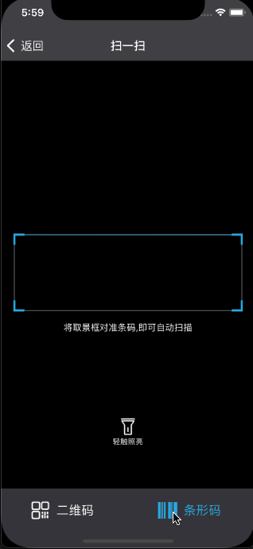

## MMScan


[](https://cocoapods.org/pods/MMScan) 
[](https://cocoapods.org/pods/MMScan)
[](https://cocoapods.org/pods/MMScan) 
[](https://github.com/MinMao-Hub/MMScan)
[](http://opensource.org/licenses/MIT)

### Introduction

`MMScan`是一个简单的二维码以及条码扫描工具，使用`Objective-C`语言开发,有一套自定义的扫描动画以及界面，还包括生成二维码以及条码【一行代码搞定】

`MMScan ` is an simple QRCode and barcode scanning tool,Contains a separate set of interfaces and a single call, as well as the generation of QRCode code and bar code, a line of code can run.

<!--### Case

最近浏览AppStore，发现有好几款App使用了我这个轮子

1. [二维码生成器](https://apps.apple.com/cn/app/%E4%BA%8C%E7%BB%B4%E7%A0%81%E7%94%9F%E6%88%90%E5%99%A8-%E6%89%AB%E4%B8%80%E6%89%AB-%E4%B8%93%E4%B8%9A%E6%89%AB%E6%8F%8F%E4%BA%8C%E7%BB%B4%E7%A0%81%E5%85%A8%E8%83%BD%E7%8E%8B/id1500180351#?platform=iphone)
2. [扫一扫](https://apps.apple.com/cn/app/%E6%89%AB%E4%B8%80%E6%89%AB-%E4%B8%93%E4%B8%9A%E4%BA%8C%E7%BB%B4%E7%A0%81%E6%9D%A1%E5%BD%A2%E7%A0%81%E6%89%AB%E6%8F%8F%E5%92%8C%E7%94%9F%E6%88%90%E5%B7%A5%E5%85%B7/id1412695729)
3. [条码生成器](https://apps.apple.com/cn/app/%E6%9D%A1%E5%BD%A2%E7%A0%81%E7%94%9F%E6%88%90%E5%99%A8-%E6%89%AB%E6%8F%8F%E5%99%A8/id1547930886)
-->

### Rquirements

* iOS 9.0+
* Xcode 9
* Xcode 8 

### Installation


#### Install with  Cocoapods

记得更新你的pod-master,命令`pod repo update master`

* `pod 'MMScan', '~> 0.0'`
* `#import <MMScan/MMScanViewController.h> `  in you code


#### Copy code into project

[克隆代码](https://github.com/MinMao-Hub/MMScan.git)，然后将MMScanner文件夹下面的所有文件【包含资源】加入到你的项目中即可。	

Just clone and add the folder `MMScanner` to your project.

### Example

* 2021.2.19 更新, 扫描区域改变动画，切换更加丝滑，参考自CSDN大佬 [iOS 为CALayer添加可动画的属性](https://blog.csdn.net/Hello_Hwc/article/details/50522634)

<div style="margin-top: 10px">
	
</div>


<div style="padding: 20px">
	
</div>
<div style="margin-top: 10px">
	
</div>


### Usage

下面仅介绍简单的使用，具体使用见[MMScanDemo](https://github.com/MinMao-Hub/MMScan.git)

引入头文件`#import "MMScanViewController.h"`,如果是使用`cocoapods`，则需要引入`#import <MMScan/MMScanViewController.h>`

***PS:注意事项***
因为会调用到相册和相机权限，所以一定要记得在`info.plist`文件中添加必要的权限代码

```
<key>NSCameraUsageDescription</key>
<string>App需要您的同意,才能访问相机</string>
<key>NSPhotoLibraryUsageDescription</key>
<string>App需要您的同意,才能访问相册</string>
<key>NSPhotoLibraryAddUsageDescription</key>
<string>App需要您的同意,才能添加图片到相册</string>
```

#### 扫描二维码&条码

```Objective-C
MMScanViewController *scanVc = [[MMScanViewController alloc] initWithQrType:MMScanTypeAll onFinish:^(NSString *result, NSError *error) {
    if (error) {
        NSLog(@"error: %@",error);
    } else {
        NSLog(@"扫描结果：%@",result);
    }
}];
[self.navigationController pushViewController:scanVc animated:YES];

```
##### 注释
1. `QrType`
	
	有三种值：【MMScanTypeAll、MMScanTypeQrCode、MMScanTypeBarCode】
	* `MMScanTypeAll`  界面下方有个菜单，支持切换二维码和条码的扫描
	* `MMScanTypeQrCode` 单纯的二维码扫描
	* `MMScanTypeBarCode` 单纯的条码扫描
2. 回调结果
	
	回调回来的是扫描结果，如果是多张二维码，也只返回一条数据【数组中的第一条】

#### 生成二维码以及条码

```
//生成二维码
UIImage *image = [MMScanViewController createQRImageWithString:_linkTfd.text QRSize:CGSizeMake(250, 250) QRColor:[UIColor blackColor] bkColor:[UIColor colorWithRed:0.318 green:0.690 blue:0.839 alpha:1.00]];

//如果不需要设置背景色以及前景色，则使用下面代码  默认白色底黑色码
UIImage *image = [ScanViewController createQRImageWithString:_linkTfd.text QRSize:CGSizeMake(250, 250)];

//生成条形码
UIImage *image = [MMScanViewController createBarCodeImageWithString:_linkTfd.text QRSize:CGSizeMake(250, 150) QRColor:[UIColor blackColor] bkColor:[UIColor colorWithRed:0.318 green:0.690 blue:0.839 alpha:1.00]];

//如果不需要设置背景色以及前景色，则使用下面代码  默认白色底黑色码
UIImage *image = [ScanViewController createBarCodeImageWithString:_linkTfd.text barSize:CGSizeMake(250, 150)];


```


### 更多

更多自定义以及修改原有属性，[请看源码](https://github.com/MinMao-Hub/MMScan/tree/master/MMScanner)

### Update Log


> *v0.0.9* [2021.2.22]

* 修复使用Cocoapods时bundle找不到问题

> *v0.0.8* [2021.2.19]

* 扫描切换动画，用起来更加丝滑
* 删除历史记录查看功能

> *v0.0.7* [2018.6.11]

> *v0.0.6* [2018.6.10]

* 新增历史记录查看功能
* 新增导航条小按钮自定义功能

<hr/>

> *v0.0.5* [2017.12.21]

* 闪光灯小按钮问题处理【扫一扫底部工具栏切换时，闪光灯会关闭，需要重置小按钮的选中状态】

<hr/>

> *v0.0.4* [2017.12.21]

1. 添加闪光灯小按钮 [#Issues-1](https://github.com/MinMao-Hub/MMScan/issues/1)

2. 底部toolBar适配iPhone X【只在模拟器测试过】


<hr/>


### Contribution

You are welcome to fork and submit pull requests.

### License

MMScan is open-sourced software licensed under the MIT license.


